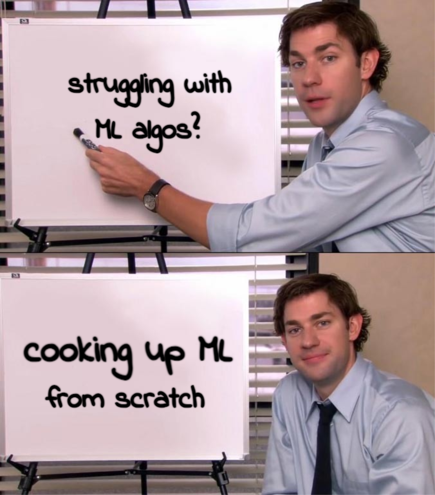

# HomemadeML



Welcome to HomemadeML, where we cook up machine learning algorithms from scratch!

## Overview

HomemadeML is a repository dedicated to implementing machine learning algorithms and models using bare-bones NumPy. From simple linear regression to deep learning, this repository aims to demystify the inner workings of ML algorithms through accessible and educational implementations.

## Features

- **From Scratch**: Dive deep into the fundamentals with implementations of algorithms purely using NumPy.
- **Educational**: Learn how popular ML models and algorithms function under the hood.
- **Accessible**: Code designed to be clear, concise, and easy to understand for enthusiasts and beginners alike.

## Getting Started

1. **Clone the repository:**

    ```bash
    git clone https://github.com/your-username/HomemadeML.git
    cd HomemadeML
    ```

2. **Explore the Implementations:**

    Browse through the directory to find implementations of various algorithms such as linear regression, logistic regression, neural networks, and more.

3. **Run the Examples:**

    Each algorithm may include example scripts or notebooks to demonstrate usage and functionality. Dive in and start experimenting!

## Examples


## Contributing

Contributions are welcome! Whether you're fixing a bug, implementing a new algorithm, or improving documentation, your contributions are appreciated. Please open an issue or submit a pull request.

## License

This project is licensed under the MIT License. See the [LICENSE](LICENSE) file for details.

---

**Cooking up machine learning from scratch with HomemadeML! 🍲🤖**
